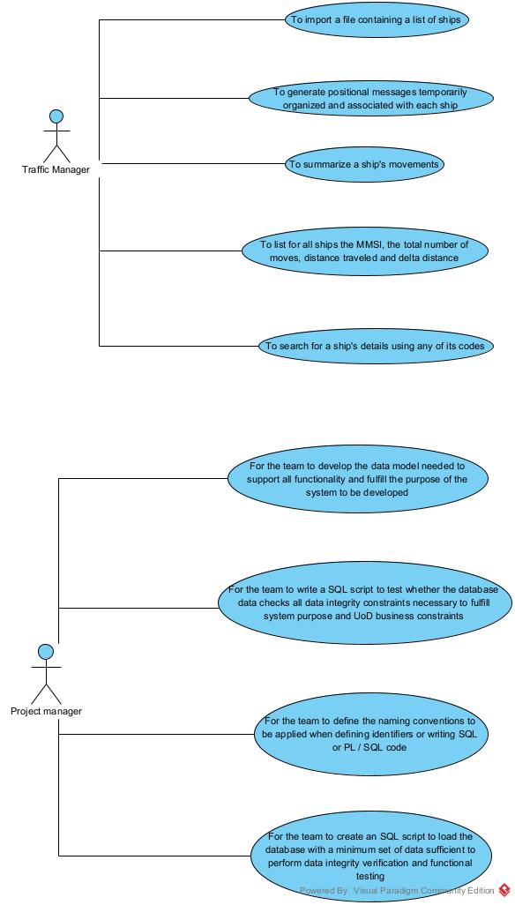

# Project Report Lapr3 - Sprint 1

## Delivery of Containers ##

### Teachers/Advisors ###

Ana Isabel Gaspar Freitas - AIF\


### Client ###
Nuno Bettencourt - NMB

## Classes DE_DF – Group 041 ##
1170504 Hugo Nogueira\
1201276 Tiago Marques 1201276\
1201381	Pedro Alves\
1201384 Pedro Fernandes\
1200801 Daniel Braga\
1180727 Ruben Martins\
	

### Abstract ###
In this report we start by explaining the initial problem that was presented to us, which consists of building a Java application that tracked the fastest routes from one point to another in the world so that the delivery of containers is more efficient.
The application must follow a Test Driven Development approach using SonarQube® servers.
Before coding development, we focused our work on the engineering software artifacts that would be relevant during coding.
All our work was distributed among the seven members of the group and we tried to follow an even distribution, however imperfect.

### Theorical Introduction ###
In this first sprint of the project that was presented to us, it required that we elaborate a product that would support the delivery of containers only by sea. In this service we should be able to import a file that contains a list of ships, and from this list return it to a BST, and basically it should allow the management of ships, dynamic data of ships and containers.


### Work Organization, Planning and Methodology ###
The methodology followed by our group is based on Scrum®, so all our work was developed in a certain way, starting with planning who and what each member of the group would do.
One of the central parts of our team was mutual help, as without it it would be almost impossible to work as a team. In this first sprint, as there was still no great chemistry between some members of the group, there were still some lack of communication, however over these three weeks we tried to help each other with doubts/difficulties.
To help organize the sprint we use Jira Software.

First, we analyze the user stories and then we build the Use Case Diagram shown below.
After that, and following a Scrum methodology, we gave an estimate value so that we could know how long each use case would take.
In the next step the use cases were distributed among the group members.
In the days that followed, each member worked on their use case and whenever someone needed to ask a question or needed help with something, the group would try to help.

Next, we start by elaborating the Use Case diagram, which can be seen below:
### Use-case diagram for this current sprint: ###



With these Use Cases in mind, we strive to build the Software Engineering diagrams.

We created the Domain Model that we would follow in the development of our sprint, which can be seen below:
### Domain template for this current sprint: ###
(...)

### SSDs Diagrams ###
Then we have elaborated some of the relevant SSDs diagrams.\
Sprint 1:


### SDs Diagrams ###
Then we have elaborated some of the relevant SDs diagrams.\


#################################################################################


# README INFO #

This is the repository template used for student repositories in LAPR Projets.

## Java source files

Java source and test files are located in folder src.

## Maven file

Pom.xml file controls the project build.

### Notes
In this file, DO NOT EDIT the following elements:

* groupID
* artifactID
* version
* properties

Beside, students can only add dependencies to the specified section of this file.

## Eclipse files

The following files are solely used by Eclipse IDE:

* .classpath
* .project

## IntelliJ Idea IDE files

The following folder is solely used by Intellij Idea IDE :

* .idea

# How was the .gitignore file generated?
.gitignore file was generated based on https://www.gitignore.io/ with the following keywords:

  - Java
  - Maven
  - Eclipse
  - NetBeans
  - Intellij

# Who do I talk to?
In case you have any problem, please email Nuno Bettencourt (nmb@isep.ipp.pt).

# How do I use Maven?

## How to run unit tests?

Execute the "test" goals.

```shell
$ mvn test
```
## How to generate the javadoc for source code?

Execute the "javadoc:javadoc" goal.

```shell
$ mvn javadoc:javadoc
```
This generates the source code javadoc in folder "target/site/apidocs/index.html".

## How to generate the javadoc for test cases code?

Execute the "javadoc:test-javadoc" goal.

```shell
$ mvn javadoc:test-javadoc
```
This generates the test cases javadoc in folder "target/site/testapidocs/index.html".

## How to generate Jacoco's Code Coverage Report?

Execute the "jacoco:report" goal.

```shell
$ mvn test jacoco:report
```

This generates a jacoco code coverage report in folder "target/site/jacoco/index.html".

## How to generate PIT Mutation Code Coverage?

Execute the "org.pitest:pitest-maven:mutationCoverage" goal.

```shell
$ mvn test org.pitest:pitest-maven:mutationCoverage
```
This generates a PIT Mutation coverage report in folder "target/pit-reports/YYYYMMDDHHMI".

## How to combine different maven goals in one step?

You can combine different maven goals in the same command. For example, to locally run your project just like on jenkins, use:

```shell
$ mvn clean test jacoco:report org.pitest:pitest-maven:mutationCoverage
```
## How to perform a faster pit mutation analysis?

Do not clean build => remove "clean"

Reuse the previous report => add "-Dsonar.pitest.mode=reuseReport"

Use more threads to perform the analysis. The number is dependent on each computer CPU => add "-Dthreads=4"

Temporarily remove timestamps from reports.

Example:
```shell
$ mvn test jacoco:report org.pitest:pitest-maven:mutationCoverage -DhistoryInputFile=target/fasterPitMutationTesting-history.txt -DhistoryOutputFile=target/fasterPitMutationTesting-history.txt -Dsonar.pitest.mode=reuseReport -Dthreads=4 -DtimestampedReports=false
```
## Where do I configure my database connection?

Each group should configure their database connection on the file:
* src/main/resources/application.properties