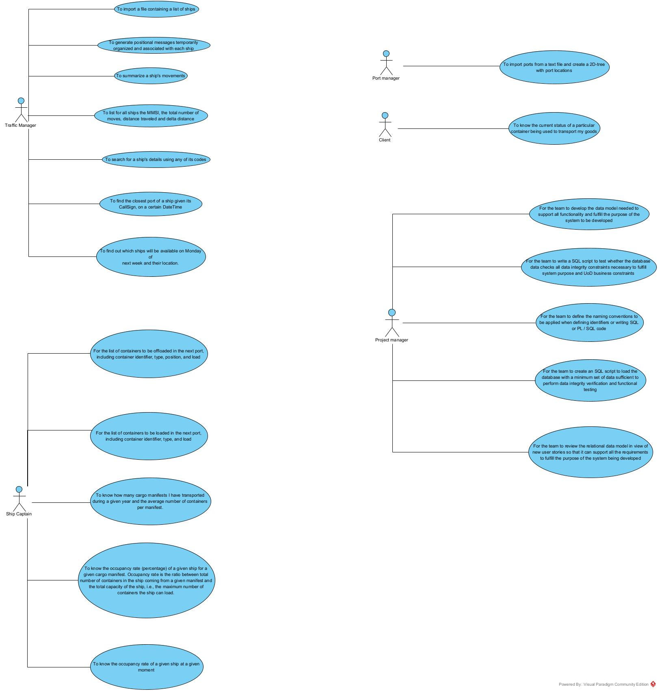
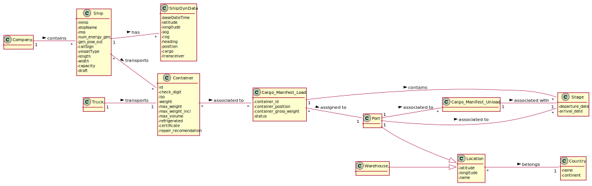
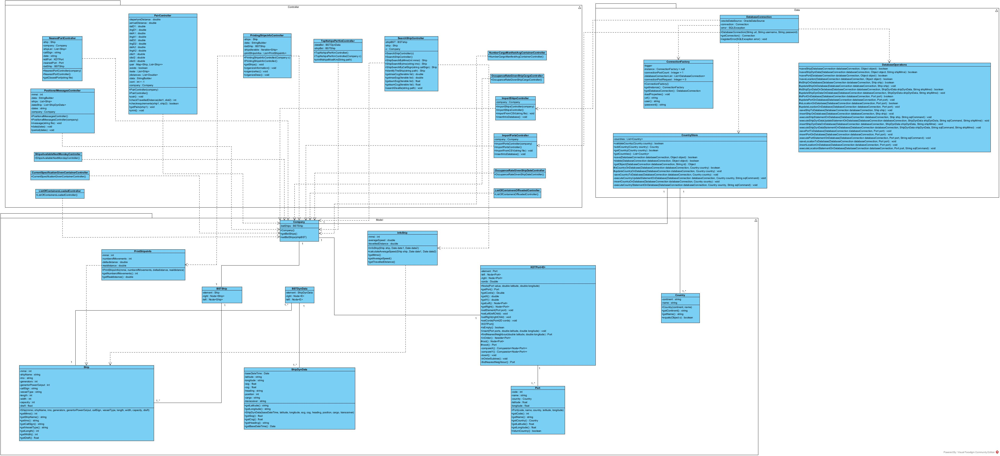
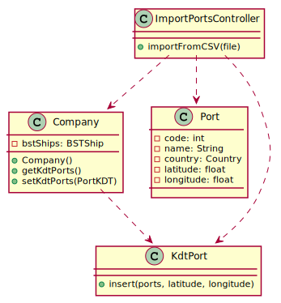
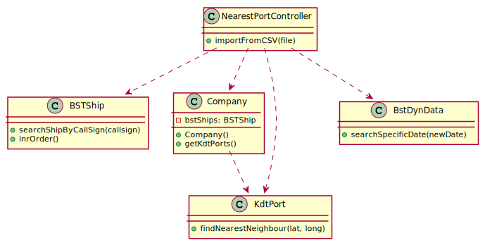

# Project Report Lapr3 - Sprint 2

## Delivery of Containers ##

### Teachers/Advisors ###

Ana Isabel Gaspar Freitas - AIF\

### Client ###
Nuno Bettencourt - NMB

## Classes DE_DF – Group 041 ##
1170504 Hugo Nogueira\
1201276 Tiago Marques 1201276\
1201381	Pedro Alves\
1201384 Pedro Fernandes\
1200801 Daniel Braga\
1180727 Ruben Martins\
	

### Abstract ###
In this report we start by explaining the initial problem that was presented to us, which consists of building a Java application that tracked the fastest routes from one point to another in the world so that the delivery of containers is more efficient.
The application must follow a Test Driven Development approach using SonarQube® and Jenkins® servers.
Before coding development, we focused our work on the engineering software artifacts that would be relevant during coding.
All our work was distributed among the seven members of the group and we tried to follow an even distribution, however imperfect.

### Theorical Introduction ###
In first sprint of the project that was presented to us, it required that we elaborate a product that would support the delivery of containers only by sea. In this service we should be able to import a file that contains a list of ships, and from this list return it to a BST, and basically it should allow the management of ships, dynamic data of ships and containers.

In this second sprint, the previously elaborated product would have to contain a coherent connection between the database and the implementation carried out in Java. In this service we should also be able to import a file that contains a list of ports and be able to find the closest port given its call sign. Then, with the help of the Pl/Sql language, the product should be able to determine some information related to the transport of goods (loading and unloading of containers) and information related to the ship, such as the current weight.

### Work Organization, Planning and Methodology ###
The methodology followed by our group is based on Scrum®, so all our work was developed in a certain way, starting with planning who and what each member of the group would do.
One of the central parts of our team was mutual help, as without it it would be almost impossible to work as a team. In this second sprint, unlike the first sprint, it was already possible to have a more active and more efficient communication and therefore, we believe that over these weeks the spirit of mutual help was much greater and much more consistent.
To help organize the sprint, we use Jira software.

We first analyze the user stories and then build the Use-Case Diagram shown below.
After that, and following a Scrum methodology, we gave an estimated value so that we could know how long each use case would take.
In the next step, the use cases were distributed among the group members.
Over the next few days, each member worked on their use case, and whenever someone needed to ask a question or needed help with something, the group would try to help.

Next, we start by elaborating the Use Case diagram, which can be seen below:
### Use-case diagram for this current sprint: ###

With these Use Cases in mind, we strive to build the Software Engineering diagrams.

We created the Domain Model that we would follow in the development of our sprint, which can be seen below:
### Domain template for this current sprint: ###

We created the Global Class Diagram that we would follow in the development of our sprint, which can be seen below:
### Domain template for this current sprint: ###

### This phase of our report is where all the diagrams referring to the project's user stories are located, whether **SSDs**, **SDs** or **CD**.

### SPRINT 1 ###

### Use Case 101 - Import ships from a text file into a BST.

### Use Case 102 - Search the details of a ship using any of its codes: MMSI, IMO or Call Sign.

### Use Case 103 - Have the positional messages temporally organized and associated with each of the ships

### Use Case 104 -  Make a Summary of a ship's movements.

### Use Case 105 - List for all ships the MMSI, the total number of movements, Travelled Distance and Delta Distance.

### Use Case 106 - Get the top-N ships with the most kilometres travelled and their average speed (MeanSOG).

### Use Case 107 - Return pairs of ships with routes with close departure/arrival coordinates (no more than 5 Kms away) and with different Travelled Distance.

### SPRINT 2 ###

### Use Case 201 - Import ports from a text file and create a 2D-tree with port locations.

### Use Case 202 - Find the closest port of a ship given its CallSign, on a certain DateTime. 

### Use Case 203 - Want the team to review the relational data model in view of the new user stories so it can support all the requirements to fulfil the purpose of the system being developed. 

### Use Case 204 - Want to know the current situation of a specific container being used to transport my goods.

### Use Case 205 - Want the list of containers to be offloaded in the next port, including container identifier, type, position, and load.

### Use Case 206 - Want the list of containers to be loaded in the next port, including container identifier, type, and load.

### Use Case 207 - Want to know how many cargo manifests I have transported during a given year and the average number of containers per manifest.

### Use Case 208 - Want to know the occupancy rate (percentage) of a given ship for a given cargo manifest. Occupancy rate is the ratio between total number of containers in the ship coming from a given manifest and the total capacity of the ship, i.e.,the maximum number of containers the ship can load.

### Use Case 209 - Want to know the occupancy rate of a given ship at a given moment.

### Use Case 210 -  Need to know which ships will be available on Monday next week and their location.

#################################################################################