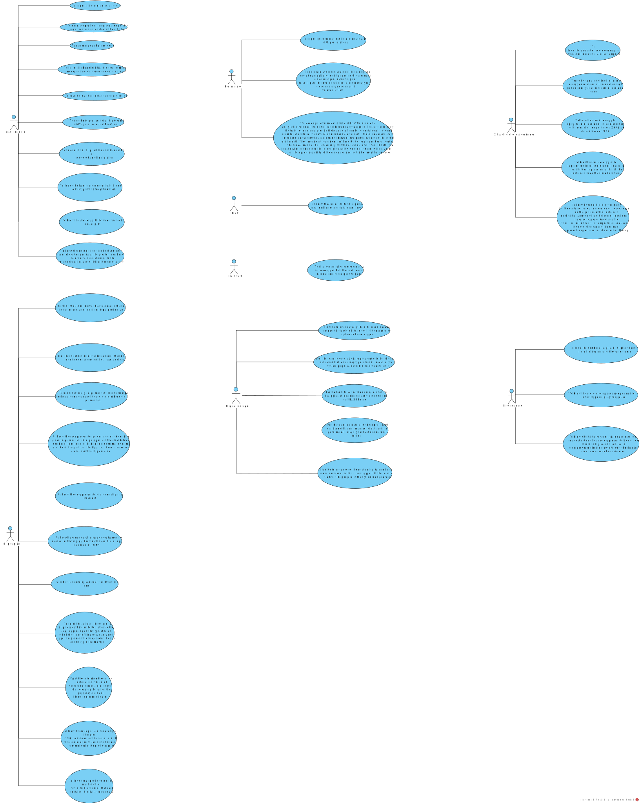
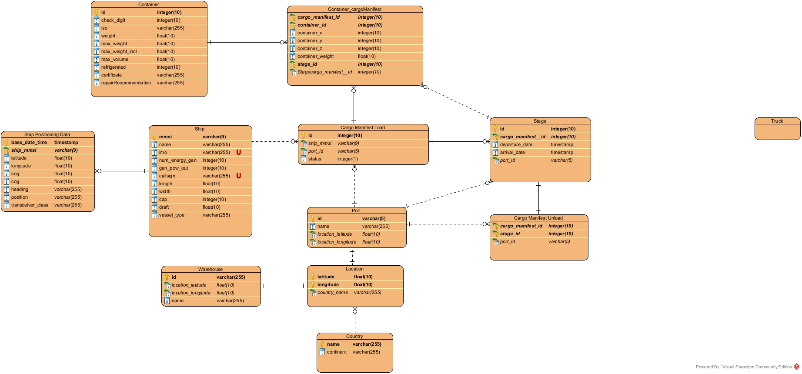
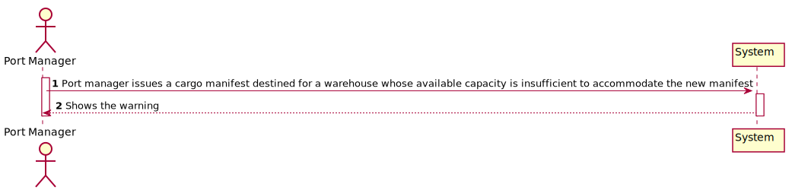
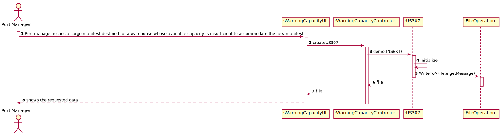
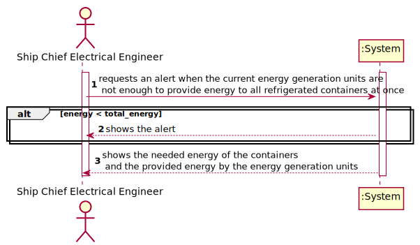

# Project Report Lapr3 - Sprint 4

## Delivery of Containers ##

### Teachers/Advisors ###

Ana Isabel Gaspar Freitas - AIF\
João Lima Lopes - JLL\

### Client ###
Nuno Bettencourt - NMB

## Classes DE_DF – Group 041 ##
1170504 Hugo Nogueira\
1201276 Tiago Marques\
1201381	Pedro Alves\
1201384 Pedro Fernandes\

### Abstract ###
In this report we start by explaining the initial problem that was presented to us, which consists of building a Java application that tracked the fastest routes from one point to another in the world so that the delivery of containers is more efficient.
The application must follow a Test Driven Development approach using SonarQube® and Jenkins® servers.
Before coding development, we focused our work on the engineering software artifacts that would be relevant during coding.
All our work was distributed amongst the five members of the group and we have tried to follow an equal distribution, however imperfect it may have been.
In this report we aim to give a brief description of our work and what our application is capable of doing.

### Theorical Introduction ###
In first sprint of the project that was presented to us, it required that we elaborate a product that would support the delivery of containers only by sea. In this service we should be able to import a file that contains a list of ships, and from this list return it to a BST, and basically it should allow the management of ships, dynamic data of ships and containers.

In second sprint, the previously elaborated product would have to contain a coherent connection between the database and the implementation carried out in Java. In this service we should also be able to import a file that contains a list of ports and be able to find the closest port given its call sign. Then, with the help of the Pl/Sql language, the product should be able to determine some information related to the transport of goods (loading and unloading of containers) and information related to the ship, such as the current weight.

In third sprint, the product that was requested and that has been developed over the last few weeks should be able to import data related to countries, ports, borders and some data referring to the database so that it would be possible to create a freight network. In this service, in addition to the aforementioned, the product should be able to identify which ports or cities are closest to all other locations and, finally, it should also be able to avoid any invalid data entered or updated within the database.

In this fourth sprint, after all the features already created and implemented in the previous sprints, the application/product should be able to know which ports are more central in the cargo network and should also be able to identify which are the most efficient circuits between the locations (cities and/or ports). In addition to these features, this sprint was very dedicated to the support of the ship in navigation, for example the energy management on the ship to maintain the temperature of the containers or even the simple planning of containers inside the ship ready to sail.

### Work Organization, Planning and Methodology ###
The methodology followed by our group is based on Scrum®, so all our work was developed in a certain way, starting with planning who and what each member of the group would do.
One of the central parts of our team was mutual help, as without it it would be almost impossible to work as a team. In this fourth sprint, in addition to the first, second and third sprints, the team was much more united and more solid in solving the problems requested during these three weeks. As expected, this project had the transparency and adaptation of each of the members of the group, as there was a constant analysis of what was done and how it was done. We believe that one of the keys to the success of this sprint was being more up to date with the pace at which the work was being developed, naturally with the help of daily meetings. To help organize the sprint, we use Jira software.

We first analyzed the user stories and then built the Use Case Diagram shown below.
After that, and following a Scrum methodology, we gave an estimated value, using the "Planning Poker" estimation technique so that we could know how long each use case would take.
In the next step, the use cases were distributed among the group members.
Over the next few days, each member worked on their use case, and whenever someone needed to ask a question or needed help with something, the group tried to help.

The way our group chose to estimate sprint 4 user stories was using a technique called planning poker. This estimation technique has as its keyword the consensus among the team and, basically, consists of each member of the group assigning a value of a card, on a defined scale (fibonacci), to the user story that we would be estimating its development time. The values assigned to each task correspond to the size/complexity that our group thought would lead to the development of the user story. Next, we present an example related to our estimation technique.

### Plannning Poker example

Next, we start by elaborating the Use Case diagram, which can be seen below:
### Use-case diagram for this current sprint: ###

With these Use Cases in mind, we strive to build the Software Engineering diagrams.

We created the Domain Model that we would follow in the development of our sprint, which can be seen below:
### Domain template for this current sprint: ###

We created the Global Class Diagram that we would follow in the development of our sprint, which can be seen below:
### Domain template for this current sprint: ###

### This phase of our report is where all the diagrams referring to the project's user stories are located, whether **SSDs**, **SDs** or **CD**.

### SPRINT 1 ###

### Use Case 101 - Import ships from a text file into a BST.

### Use Case 102 - Search the details of a ship using any of its codes: MMSI, IMO or Call Sign.

### Use Case 103 - Have the positional messages temporally organized and associated with each of the ships

### Use Case 104 -  Make a Summary of a ship's movements.

### Use Case 105 - List for all ships the MMSI, the total number of movements, Travelled Distance and Delta Distance.

### Use Case 106 - Get the top-N ships with the most kilometres travelled and their average speed (MeanSOG).

### Use Case 107 - Return pairs of ships with routes with close departure/arrival coordinates (no more than 5 Kms away) and with different Travelled Distance.

### SPRINT 2 ###

### Use Case 201 - Import ports from a text file and create a 2D-tree with port locations.

### Use Case 202 - Find the closest port of a ship given its CallSign, on a certain DateTime. 

### Use Case 203 - Want the team to review the relational data model in view of the new user stories so it can support all the requirements to fulfil the purpose of the system being developed. 

### Use Case 204 - Want to know the current situation of a specific container being used to transport my goods.

### Use Case 205 - Want the list of containers to be offloaded in the next port, including container identifier, type, position, and load.

### Use Case 206 - Want the list of containers to be loaded in the next port, including container identifier, type, and load.

### Use Case 207 - Want to know how many cargo manifests I have transported during a given year and the average number of containers per manifest.

### Use Case 208 - Want to know the occupancy rate (percentage) of a given ship for a given cargo manifest. Occupancy rate is the ratio between total number of containers in the ship coming from a given manifest and the total capacity of the ship, i.e.,the maximum number of containers the ship can load.

### Use Case 209 - Want to know the occupancy rate of a given ship at a given moment.

### Use Case 210 -  Need to know which ships will be available on Monday next week and their location.

### SPRINT 3 ###

### Use Case 301 - I which to import data from countries, ports, borders and seadists from the database to build a freight network. 

### Use Case 302 - I wish to colour the map using as few colours as possible.

### Use Case 303 - I wish to know which places (cities or ports) are closest to all other places (closeness places).

### Use Case 304 -  I want to have access to audit trails for a given container of a given cargo manifest, that is, I want to have access to a list of all operations performed on a given container of a given manifest, in chronological order. For each operation I want to know: the user/login that performed it, the date and time the operation was performed, the type of operation (INSERT, UPDATE, DELETE), the container identifier and the 
cargo manifest identifier.

### Use Case 305 - I want to know the route of a specific container I am leasing.

### Use Case 306 - I want to know the occupancy rate of each warehouse and an estimate of the containers leaving the warehouse during the next 30 days.

### Use Case 307 -  I intend to get a warning whenever I issue a cargo manifest destined for a warehouse whose available capacity is insufficient to accommodate the new manifest.

### Use Case 308 - I want to have a system that ensures that the number of containers in a manifest does not exceed the ship's available capacity. 

### Use Case 309 - I do not allow a cargo manifest for a particular ship to be registered in the system on a date when the ship is already occupied.

### Use Case 310 - I intend to have a map of the occupation of the existing resources in the port during a given month.

### Use Case 311 - I want to provide a database access account, with login “crew” and password “bd7wd5aF”, which gives access exclusively to the information of the containers that are loaded on my ship. The information about each container to be made available is: identifier, type, position and load.

### Use Case 312 -  I want to know the current situation of a specific container being used to transport my goods – US204.

### SPRINT 4 ###

### Use Case 401 - I wish to know which ports are more critical (have greater centrality) in this freight network.

### Use Case 402 - I wish to know the shortest path between two locals (city and/or port). 

### Use Case 403 -  I wish to know the most efficient circuit that starts from a source location and visits the greatest number of other locations once, returning to the starting location and with the shortest total distance.
 

### Use Case 404 - I want to know the number of days each ship has been idle since the beginning of the current year. 

### Use Case 405 - I want to know the average occupancy rate per manifest of a given ship during a given period.
 

### Use Case 406 - I want to know which ship voyages – place and date of origin and destination – had an occupancy rate below a certain threshold; by default, consider an occupancy rate threshold of 66%. Only the trips already concluded are to be considered. 

### Use Case 407 - I intend to generate, a week in advance, the loading and unloading map based on ships and trucks load manifests and corresponding travel plans, to anticipate the level of sufficient and necessary resources (loading and unloading staff, warehouse staff, ...).

### Use Case 409 - I wish to fill a dynamically reserved matrixarray in memory with all the container's information in its respective place.

### Use Case 410 - I want to know the amount of needed energy to keep the container at its required temperature.

### Use Case 411 - I want to receive an alert when the current energy generation units are not enough to provide energy to all refrigerated containers at once.

### Use Case 412 - We intend to know how much energy to supply, for each container, in a determined trip, with an exterior temperature of 20 ºC, and a travel time of 2h30. 

### Use Case 413 - The objective is to know the total energy to be supplied to the set of containers in a certain established trip, assuming that all the containers have the same behaviour.

### Use Case 414 - We want to know how much energy to supply to the container cargo, in a voyage (or route), depending on the position of the containers on the ship. Admitting that the interior containers, or the sides not exposed directly to the "sun", maintain the initial temperature, or of departure. However, the exposed sides may present temperature variations during the trip.

### Use Case 415 - I need to know how many auxiliary power equipment are needed for the voyage, knowing that each one supplies a maximum of 75 KW.

### Use Case 417 -  I want the technical team to search for at least three types of ship/vessels that are better suited to the task (e.g., depending on the type of cargo), in which the “control” bridge can assume three positions, one in the bow, one in the stern, and finally in the midship.

### Use Case 418 - I want the determine the unladen center of mass for each vessel (if different) according to its characteristics. For calculation purposes, consider known geometric figures.

### Use Case 419 - I want to know where to position, for example, one hundred (100) containers on the vessel, such that the center of mass remains at xx and yy,determined in the previous point. 

### Use Case 420 - I want to know for a specific vessel, how much did the vessel sink, assuming that each container has half a ton of mass. 

#################################################################################